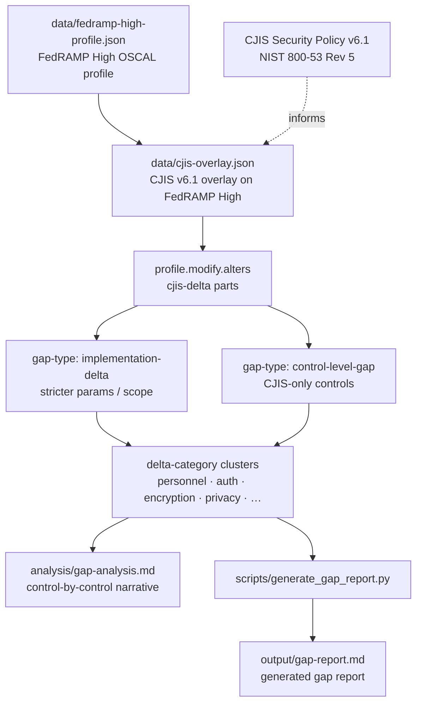

# CJIS v6.1 to FedRAMP High Gap Analysis

I built this to answer a narrow question: if a CSP already holds FedRAMP High, which
CJIS Security Policy v6.1 requirements still sit outside that baseline? CJIS v6.x
uses NIST 800-53 Rev 5 and has been the default audit baseline since April 1, 2026;
v6.1 (released June 25, 2026) is the current revision. The repo holds a FedRAMP High OSCAL profile, a CJIS overlay that records each
delta, a hand-authored narrative in `analysis/gap-analysis.md`, and a generator that
rebuilds `output/gap-report.md`.

The tables below list 13 implementation-level deltas and 12 control-level gaps. That
is the scoped set I verified against the published v6.0 text and re-checked against
the v6.1 List of Priorities; it is not a claim that
every possible CJIS nuance is catalogued.

## Architecture Overview



Editable Mermaid source (kept in sync with the fence above): [`docs/architecture.mmd`](docs/architecture.mmd).

The FedRAMP High profile is the import baseline. The CJIS overlay adds
`profile.modify.alters` entries as `cjis-delta` parts with `gap-type` and
`delta-category` props. Read `analysis/gap-analysis.md` for the prose, or run
`scripts/generate_gap_report.py` to regenerate `output/gap-report.md` from the
overlay JSON.

## Why This Matters

Both frameworks sit on NIST 800-53 Rev 5, so a FedRAMP High ATO covers most of
CJIS v6.1. Most is not all. CJIS tightens screening, authentication, encryption key
custody, audit review cadence, and several privacy controls that FedRAMP High never
picked up. If you treat the ATO as equivalent without walking the deltas, the miss
shows up in a CJIS audit as missing evidence or missing controls, not as a small
paperwork gap.

This repo names those deltas in tables and in OSCAL so the list is fixed and
regenerable.

## Gap Summary

The gap analysis distinguishes two categories of gaps between CJIS v6.1 and FedRAMP High:

- **Implementation-level deltas** - controls present in both baselines, where CJIS imposes stricter parameters, scope, or methodology (e.g., CJIS requires fingerprint-based background checks for PS-3, while FedRAMP allows the organization to define screening method).
- **Control-level gaps** - controls present in the CJIS v6.1 baseline but absent from FedRAMP High entirely. An agency running FedRAMP High must implement these from scratch to satisfy CJIS. These are concentrated in the NIST 800-53 Rev 5 privacy overlay, reflecting CJI's status as sensitive personal data.

### Implementation-Level Deltas

Controls where CJIS v6.1 imposes stricter requirements than the FedRAMP High baseline:

| NIST 800-53 Rev 5 | FedRAMP High | CJIS v6.1 Delta | Category |
|--------------------|:------------:|------------------|----------|
| PS-3 Personnel Screening | Background investigation | Fingerprint-based background check (state/national) required for all CJI access | Personnel |
| PS-6 Access Agreements | Signed rules of behavior | CJIS Security Addendum required before CJI access | Personnel |
| IA-2 Identification & Authentication | MFA required | AAL2 phishing-resistant MFA; Advanced Authentication for CJI access | Authentication |
| IA-5 Authenticator Management | Complexity/rotation per baseline | Minimum 8-char passwords, specific complexity rules, 90-day max lifetime | Authentication |
| MP-6 Media Sanitization | Sanitize before disposal/reuse | Prescriptive sanitization procedures per media type; physical destruction requirements for CJI media | Media Protection |
| SC-12 Cryptographic Key Management | FIPS-validated modules | Agency-managed encryption keys; FIPS 140-2/140-3 validated modules | Encryption |
| SC-13 Cryptographic Protection | FIPS-validated crypto | Minimum 128-bit symmetric / 2048-bit asymmetric key lengths for CJI | Encryption |
| SC-28 Protection of Info at Rest | Encryption at rest required | Agency-managed CMK required for CJI at rest; agency retains key revocation authority | Encryption |
| AU-6 Audit Record Review | Review/analysis per baseline | Weekly audit log review; 1-year minimum retention for CJI-related events | Audit |
| AC-2 Account Management | Account lifecycle per baseline | Quarterly access reviews for CJI-authorized users | Access Control |
| IR-6 Incident Reporting | Report to US-CERT | Additional reporting to state CSA-designated recipient (CSO, SIB Chief, or Interface Agency Official per CJIS v6.1 IR-6, page 171) within state-defined timeframes | Incident Response |
| PE-17 Alternate Work Site | Authorize alternate sites | Specific controls for remote CJI access locations | Physical/Environmental |
| AT-2 Awareness Training | Annual security training | CJIS Security Awareness Training within 6 months of CJI access, biennial refresher | Training |

### Control-Level Gaps

Controls present in the CJIS v6.x published control set that are not in FedRAMP High. Baseline comparison tooling flagged 15 CJIS-only candidates; verification against the published v6.0 document confirmed 12. The three excluded candidates (SI-18, SI-18.4, SI-19 from the NIST 800-53 Rev 5 privacy overlay) are not in the v6.x control set — v6.1 removed them from the List of Priorities entirely, confirming the exclusion. See `analysis/gap-analysis.md` Methodology section for details.

| NIST 800-53 Rev 5 | Family | CJIS v6.1 Requirement | Cluster |
|--------------------|--------|------------------------|---------|
| SI-12.1 Limit PII Elements | System and Information Integrity | Limit PII elements processed across CJI lifecycle per org-defined list | Privacy, Retention |
| SI-12.2 Minimize PII in Testing, Training, Research | System and Information Integrity | De-identification, synthetic data, or masking for non-production CJI | Privacy, Retention |
| SI-12.3 Information Disposal | System and Information Integrity | Logical/cryptographic erasure or physical destruction at end of retention | Privacy, Retention |
| AU-3.3 Limit PII in Audit Records | Audit and Accountability | Log object IDs, not object content; minimize PII in audit records | PII Limitation |
| PE-8.3 Limit PII in Visitor Access Records | Physical and Environmental Protection | Visitor logs collect only operationally necessary PII elements | PII Limitation |
| AC-3.14 Individual Access | Access Control | Mechanism for individuals to access their own PII, with exemptions | PII Limitation |
| SC-7.24 PII Processing Rules at Boundaries | System and Communications Protection | Boundary enforcement of PII processing rules with exception tracking | PII Limitation |
| AT-3.5 Role-Based Training on PII Processing | Awareness and Training | Role-based training for personnel processing CJI (distinct from AT-2) | Training |
| IR-2.3 Breach Response Training | Incident Response | Breach-specific IR training with tabletop exercises and insider-misuse framing | Training |
| IR-8.1 IR Plan for Breaches | Incident Response | Notice determination, harm assessment, applicable privacy requirements | Incident Response Planning |
| PL-9 Central Management | Planning | Centrally manage a defined set of security and privacy controls | Central Management |
| SA-8.33 Minimization as Engineering Principle | System and Services Acquisition | Privacy-by-design in SDLC with PIA and architectural review | Engineering |

> **Note:** The implementation-level deltas table represents the initial scoping analysis. Additional controls may surface during full OSCAL baseline resolution.

## How an Auditor Uses This Output

Start from the FedRAMP High package, then open either `analysis/gap-analysis.md` or
the generated `output/gap-report.md`. For each row I expect four things on the
working copy: what FedRAMP High already covers, what CJIS adds, how the agency
plans to close it (policy, technical control, or process), and what artifact will
prove the close. That turns "is FedRAMP enough?" into a 25-row checklist (13 + 12)
instead of a verbal assurance.

## FedRAMP 20x Alignment

The overlay in `data/cjis-overlay.json` is already OSCAL profile JSON. Import the
FedRAMP High profile, apply the CJIS alters, and you can diff parameters and
added controls in tooling instead of maintaining a one-off spreadsheet. I use that
shape so a later continuous check can re-run the same comparison when either
baseline moves. The hand narrative stays the human-readable half; the overlay is
the machine-readable half.

## CJIS v6.x Context

CJIS Security Policy v6.0 was published Dec 27, 2024 and finished the move onto
NIST 800-53 Rev 5. v6.1 (released June 25, 2026) incorporates the Calendar Year
2025 corrections and additions approved by the APB; it keeps the same modernized
structure and, for this gap set, changes nothing beyond dropping SI-18/SI-19 from
the List of Priorities. Rollout is phased: v5.9.5 scored through March 31, 2026;
v6.x is the default audit baseline from April 1, 2026; Priority-1 controls
including MFA have been sanctionable since Oct 1, 2024; Priority 2-4 are fully
enforceable Oct 1, 2027 (state CSA timing varies; Texas, for example, runs
v5.9.5 through March 31, 2027). Changes that matter for this gap set:

- Full adoption of the NIST 800-53 Rev 5 control catalog (previously mapped to Rev 4)
- Updated Advanced Authentication requirements aligned with NIST SP 800-63-3
- Explicit FIPS 140-2/140-3 validation requirements for cryptographic modules
- Restructured policy sections mapping directly to 800-53 control families

Sharing the Rev 5 catalog with FedRAMP High is why a clean delta table is possible
here in a way it was not under v5.9.x.

## Project Structure

```
├── analysis/
│   └── gap-analysis.md             # Control-by-control delta analysis
├── data/
│   ├── fedramp-high-profile.json   # FedRAMP High baseline (OSCAL profile)
│   └── cjis-overlay.json           # CJIS v6.1 overlay (OSCAL profile)
├── docs/
│   └── architecture.mmd            # Mermaid source (sync with README fence)
├── scripts/
│   └── generate_gap_report.py      # Gap report generator (OSCAL → markdown)
├── output/
│   └── gap-report.md               # Generated gap report
├── README.md
└── LICENSE.txt
```

## License

MIT
